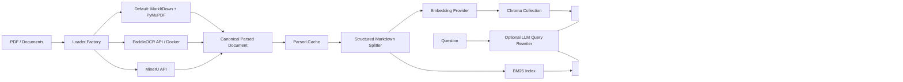

# Agentic Knowledge Hub

一个面向企业文档的配置驱动 RAG 检索基础设施。项目覆盖 PDF 解析、结构化切分、
Dense/BM25 混合检索、Weighted RRF、Cross-Encoder/LLM Rerank、评估、Trace
Dashboard 与 MCP Server，并通过统一 Provider/Factory 接口替换模型和后端。

当前版本已完成并进入维护状态。它定位为 **Retrieval and Evidence Layer**：MCP
工具返回可追溯的完整证据，上游 Agent 负责多轮规划和最终答案生成。

## 项目结果

保存的 FinanceBench 30 题开发集实验使用 Qwen3-Embedding-0.6B、Dense 召回与
Qwen3-Reranker-0.6B，结果如下：

| 指标 | @5 | @7 | @10 |
|---|---:|---:|---:|
| Document Hit Rate | 100.00% | 100.00% | 100.00% |
| Document MRR | 87.22% | 87.22% | 87.22% |
| Page Hit Rate | 66.67% | 71.67% | 76.11% |
| Macro Evidence Hit Rate | 66.67% | 71.67% | 75.00% |
| Macro Context Recall | 67.11% | 72.67% | 76.00% |
| Macro Context Precision | 14.67% | 11.43% | 8.33% |

这组结果说明系统能稳定找到正确文档，`Document MRR@10 = 87.22%`；主要瓶颈则是
表格证据的精确页级定位和 Top-K 噪声，而不是文档级召回。结果来自固定 seed 的 30 题
开发子集，不宣称代表完整 FinanceBench。去除凭据后的机器可读报告见
[`benchmark_results/financebench_dev30_summary.json`](benchmark_results/financebench_dev30_summary.json)。

单次 30 题运行共耗时约 304.8 秒。按 Case 统计的查询与 LLM Judge 总延迟为：

| Count | Average | P50 | P95 | Max |
|---:|---:|---:|---:|---:|
| 30 | 10.16 s | 10.24 s | 14.31 s | 14.75 s |

这些是端到端 Case 延迟，不等于纯检索延迟。纯检索、RRF 与 Rerank 耗时通过 Query
Trace 分阶段记录。

## 为什么做这个项目

RAG 的困难通常不在于调用一次向量数据库，而在于让不可控文档变成可解释、可评估、
可恢复的检索系统。本项目重点解决以下工程问题：

- PDF 表格、标题、页眉页脚和跨页内容如何进入统一解析契约。
- Chunk 如何保持语义结构，同时保留准确页码与字符 Offset。
- Dense 与 BM25 如何融合，Reranker 是否真的改善了排序。
- 更换 Loader、Embedding、Chunk Size 后如何避免错误复用旧索引。
- LLM Judge、Prompt 和模型调用如何记录质量、Token 与延迟。
- MCP Client 如何同时获得适合 LLM 阅读的 XML 和适合程序处理的 JSON。

## 系统架构



## 已实现的工程能力

### 1. Provider-Neutral PDF Parsing

Loader Factory 支持三条路径：

| Provider | 用途 |
|---|---|
| `default` | MarkItDown 提取文本，PyMuPDF 提供物理页信息与可选图片处理 |
| `paddle` | PaddleOCR-VL，可选择本地 Docker Transformers 或异步 Job API |
| `mineru` | MinerU API，保留标题、文本、HTML Table 和页级结构 |

Paddle 与 MinerU 的输出先归一化为相同的 Parsed Block，再由 Canonical Document
Assembler 生成统一 Markdown、页级字符 Span 和 Metadata。Splitter 因此不依赖特定
OCR Provider，后续增加 Loader 时只需实现 Normalizer。

Parsed Cache 使用 `PDF SHA-256 + Loader 配置 Hash` 作为键。OCR、Loader 或输出策略
改变时会生成新缓存；相同配置则直接复用，避免 Benchmark 消融实验重复支付解析成本。

### 2. 结构感知 Chunking

`StructuredMarkdownSplitter` 先构建 Markdown Section Tree，再在 Section 内识别：

- 普通 Text Unit
- HTML/Markdown Table Unit
- List、Code Block 与其他特殊结构
- Table Caption、Footnote 与相邻上下文

普通文本使用 Token/Character Recursive Splitter；表格保持完整 Parent 内容，并可将同页、
同 Section、位置连续的表格组成 Table Group。Caption 和 Footnote 归属表格，不再重复生成
噪声 Text Chunk。每个 Chunk 保留：

```json
{
  "doc_id": "...",
  "source_path": "...",
  "chunk_index": 12,
  "start_offset": 60500,
  "end_offset": 62500,
  "page_start": 11,
  "page_end": 12,
  "section_path": "Financial Statements > Segment Results",
  "chunk_role": "table_group"
}
```

完整原文只保存在 Chroma `documents`；Metadata 不再重复保存 `text`。Dense 可以使用
独立的 `dense_index_text`，但 MCP 返回的始终是完整原始 Chunk。

### 3. Table Summary Alias

对于超长 Table Group，可以为完整表格生成一条补充 Summary Vector：

```text
Original Table Group ----> Chroma document / final evidence
        |
        +---- LLM Summary ----> Dense alias embedding
```

Summary Alias 与 Parent 使用相同 `retrieval_group_id`。RRF 命中 Alias 后会去重并优先返回
原始 Table Group，不用摘要代替证据。Summary 失败时默认跳过 Alias，原始表格仍能入库。

### 4. Query Rewriter Plugin

可选 LLM Query Rewriter 会先识别问题类型、实体、指标、期间、比较条件和可能来源，再决定
是否生成改写查询。原问题始终保留；多个改写共同分享 `rewrite_weight`，避免生成越多 Query
就获得越大的 RRF 投票权。

```yaml
retrieval:
  query_rewriter:
    enabled: false
    provider: "llm"
    prompt_path: "config/prompts/query_rewriter.txt"
    max_queries: 4
    rewrite_weight: 0.7
    fail_on_error: false
    llm: {}  # 空映射表示复用全局 LLM
```

LLM 返回非法 JSON 或调用失败时，系统默认回退原始 Query。上游 Agent 已提供
`query_variants` 时会绕过内部改写，避免重复 Query Expansion。

### 5. Hybrid Retrieval 与 Rerank

Query Engine 支持：

```text
Original/Rewritten Queries
    -> Dense Top-K + BM25 Top-K
    -> Weighted Reciprocal Rank Fusion
    -> Optional Local/API Cross-Encoder or LLM Reranker
    -> Final Top-K Evidence
```

Weighted RRF 使用：

```text
score(d) = sum(weight_i / (rrf_k + rank_i(d)))
```

项目支持 Dense Only、BM25 Only、Hybrid RRF 和 Hybrid + Reranker 消融。已进行的 Bad
Case 分析显示：提高 Embedding 规模并不保证页级证据提升；候选数、表格结构、OCR 正确性、
Dense/BM25 权重与 Reranker 输入共同决定结果。因此所有改动都通过同一冻结子集比较，而不是
只展示单个成功 Query。

### 6. 幂等性与索引复用

- 文档摄取键包含文件 Hash 与 Collection，重复摄取可安全跳过。
- Chunk ID 绑定 Document、Source Path、Chunk Index 与 Content Hash。
- 强制重建会同时删除 Chroma 和 BM25 中属于该文档的旧记录。
- Benchmark 根据 Loader、Chunking、Embedding 与索引相关配置生成 Fingerprint。
- 只改变 Top-K、Reranker 或评估 Metric 时可以复用已有 Collection。

## Trace 与可观测性

每次 Ingestion 和 Query 都拥有独立 `trace_id`，按顺序写入 JSONL。Query Trace 包含：

| Stage | 记录内容 |
|---|---|
| `query_rewriting` | 问题类型、Slots、策略、改写 Query 与耗时 |
| `query_processing` | 原问题、关键词和解析出的 Filter |
| `dense_retrieval` | Provider、Top-K、Chunk ID、原始分数、完整文本和耗时 |
| `sparse_retrieval` | BM25 关键词、候选、分数与耗时 |
| `fusion` / `multi_query_fusion` | RRF 权重、输入列表、融合排名与耗时 |
| `rerank` | Rerank 前后顺序、模型、Fallback 原因与耗时 |
| response | Citation、页码、图片和最终返回结果 |

Dashboard 可以按 Trace 查看召回结果、排名变化和阶段延迟；Benchmark 页面展示每个实验的
配置 Metric、总耗时、Average/P50/P95/Max Case Latency 与逐题结果。错误不会只留下一个
最终异常，而会保留失败 Stage 和 Fallback 路径。

```powershell
python scripts/start_dashboard.py --port 8501
```

访问 `http://localhost:8501`。

## 评估体系

FinanceBench 适配自 [Patronus AI FinanceBench](https://github.com/patronus-ai/financebench)。
项目使用固定 Sample、Seed、Atomic Facts 和 Evidence Judge Prompt 进行可重复比较。

| Metric | 含义 |
|---|---|
| `document_hit_rate@K` | 每条参考 Evidence 对应文档在 Top-K 中被命中的比例 |
| `document_mrr@K` | 第一个正确文档排名的倒数 |
| `page_hit_rate@K` | 正确文档且 Chunk 页范围覆盖参考页的 Evidence 比例 |
| `macro_evidence_hit_rate@K` | 每题先计算 Evidence 命中比例，再对问题平均 |
| `micro_evidence_hit_rate@K` | 聚合所有 Evidence 后计算整体命中比例 |
| `macro_evidence_mrr@K` | 每题第一个匹配 Evidence Rank 的倒数，再宏平均 |
| `macro_context_recall@K` | 被检索上下文支持的 Atomic Facts 比例，再按题平均 |
| `context_precision@K` | Judge 判定相关的 Chunk 数除以实际返回的 Top-K Chunk 数 |
| Ragas Metrics | 可选的 Faithfulness、Answer Relevancy、Context Precision/Recall |

Evidence Judge 只接收正确文档和页码范围内的候选 Chunk，减少“错误文档碰巧包含相似数字”
造成的假阳性；参考 Evidence 会预先分解并冻结为 Atomic Facts，避免每次运行重新生成标准。
Judge 分批处理候选，返回匹配 Rank、Fact Support 和解释，便于人工复核。

### 延迟与成本指标

模型或 Prompt 压测不只记录平均值，而是记录：

- `Average / P50 / P90 / P95 / P99 / Max / Standard Deviation`
- Input、Output、Total Token
- Cached/Uncached Input Token
- Reasoning Output Token（Provider 提供时）
- Summary 字符数、模型名称与输出 Hash

保存的最大表格 Summary 压测执行 10 次：平均 7.59 秒、P50 6.77 秒、P95 12.12 秒、
P99 13.05 秒；平均 Input 10,007 Token、Output 980.8 Token，其中缓存 Input 平均
3,264 Token。该结果用于观察单模型尾延迟和缓存收益，不代表所有 Provider。

## MCP Server

Server 使用官方 Python MCP SDK 与 stdio transport，暴露：

| Tool | 返回内容 |
|---|---|
| `query_knowledge_hub` | 完整 Chunk、来源、页码范围、分数与可选图片 |
| `list_collections` | Collection、Document 数和 Chunk 数 |
| `list_documents` | 指定 Collection 的文档目录与 `doc_id` |
| `get_document_summary` | 文档 Metadata 与内容预览 |

`query_knowledge_hub` 默认在 `content` 返回适合 LLM 阅读的完整 XML，同时在
`structuredContent` 返回同源 JSON。两者均来自一个 Canonical Payload，避免展示内容与
Agent State 不一致。

```json
{
  "content": [{"type": "text", "text": "<retrieval_results>...</retrieval_results>"}],
  "structuredContent": {
    "query": "What was reported revenue?",
    "collection": "financebench",
    "results": [
      {
        "rank": 1,
        "chunk_id": "...",
        "text": "Complete chunk text...",
        "source": {"doc_id": "...", "page_start": 48, "page_end": 49},
        "scores": {"fusion": 0.034, "rerank": 0.91}
      }
    ]
  },
  "isError": false
}
```

Client 配置：

```json
{
  "mcpServers": {
    "agentic-knowledge-hub": {
      "command": "conda",
      "args": ["run", "-n", "mini-agent", "python", "-m", "src.mcp_server.server"],
      "cwd": "C:\\path\\to\\agentic-knowledge-hub"
    }
  }
}
```

## 快速开始

### 安装

```powershell
conda create -n mini-agent python=3.11 -y
conda activate mini-agent
pip install -e ".[dev]"
Copy-Item config/settings.yaml.example config/settings.yaml
```

填写所选 Provider 的模型、Base URL 和凭据。`config/settings.yaml` 被 Git 忽略。

### 摄取

```powershell
python scripts/ingest.py --path sample_documents/report.pdf --collection knowledge_hub
python scripts/ingest.py --path sample_documents --collection knowledge_hub
```

使用 `--force` 删除目标文档旧索引并重新摄取。

### 查询

```powershell
python scripts/query.py `
  --query "What does the report say about revenue?" `
  --collection knowledge_hub `
  --verbose
```

### MCP

```powershell
python -m src.mcp_server.server
```

### Benchmark

```powershell
python scripts/prepare_benchmark.py --config config/settings.yaml
python scripts/evaluate.py --config config/settings.yaml --dry-run
python scripts/evaluate.py --config config/settings.yaml --experiments baseline
```

实验结果输出为 Summary JSON、逐题 JSONL 和 Comparison CSV，支持 Checkpoint Resume。

### 清理运行数据

```powershell
python scripts/clear_data.py --all --dry-run
python scripts/clear_data.py --all --yes
python scripts/clear_data.py --storage --keep-parsed --yes
```

## 项目结构

```text
config/                     Settings Example 与版本化 Prompt
scripts/                    Ingest、Query、Evaluate、Dashboard、清理与诊断脚本
src/core/                   Settings、Types、Query Engine、Response、Trace
src/ingestion/              Pipeline、Transform、Embedding 与 Storage
src/libs/loader/            Loader、Normalizer、Canonical Assembler 与 Parsed Cache
src/libs/query_rewriter/    Query Rewriter 接口、LLM Provider 与 Factory
src/libs/splitter/          Recursive/Structured Markdown Splitter 与 Table Parser
src/libs/reranker/          Local/API Cross-Encoder 与 LLM Reranker
src/mcp_server/             MCP Server、Protocol Handler 与 Tools
src/observability/          Dashboard、Evaluation、Evidence Judge 与 Metrics
tests/                      Unit、Integration、E2E 与 Fixtures
benchmark_results/          去除凭据的可复现结果摘要
```

## 测试

```powershell
pytest tests/unit -q
pytest tests/integration/test_hybrid_search.py `
       tests/integration/test_hybrid_query_rewriter.py -q
pytest tests/e2e/test_mcp_client.py tests/e2e/test_mcp_sdk_client.py -q
```

真实 Provider 测试需要对应 API Key、模型与配置；Mock/Fixture 测试不访问网络。项目收尾时
单元测试结果为 `1613 passed, 2 skipped`，Query Rewriter 和 Hybrid Search 定向
Integration 测试全部通过。

## 项目边界

- 当前版本不直接生成生产答案；它向 Agent 返回证据和 Citation。
- 30 题结果是开发集实验，不是完整 FinanceBench 最终榜单。
- OCR 无法保证对所有 PDF 完美解析，因此保留 Provider 切换、Parsed Artifact 与人工审计工具。
- Query Rewriter 和 Table Summary 是可选策略；启用后应重新运行冻结评测集，不能假定必然涨分。
- `data/`、日志、原始 Benchmark、Chroma、BM25 与真实配置均不进入 Git。

项目至此完成了一个可运行、可替换、可追踪、可评估的 RAG Knowledge Hub。后续 Agentic
Workflow 可以通过 MCP 复用该检索层，而不需要修改文档解析与索引核心。
